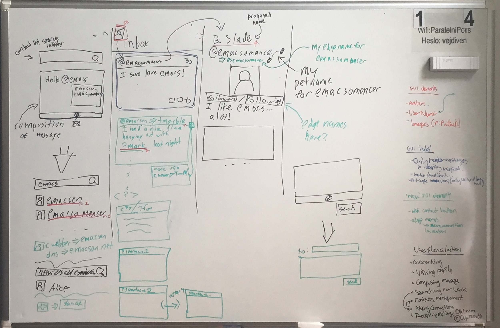

# Secure User Interfaces

## Abstract

As critical human activities are increasingly being conducted online such as personal and commercial communications, transmission of funds, voting, providing legally-binding digital signatures, and so on, the importance of designing interfaces that are both user-friendly and secure is growing.

Using a social messaging interface as a use case, we focus on the need to co-design user experience and underlying security foundations.

<!-- This paper has three parts. -->

<!-- First we will define criteria of a secure communication system including technical feasibility, ethical desirability and usability.  -->

<!-- We will then explore the requirements of a user interface that conveys the security of the system to users in an intuitive way, with an emphasis on inclusive design.  -->

<!-- We will conclude by issuing recommended design patterns and principles illustrated via best practices for decentralized applications. -->

<!-- ## Requirements -->

## Introduction

> Interface: a surface regarded as the common boundary of two bodies, spaces, or phases. -- [dictionary.com](https://www.dictionary.com/browse/interface)

By enabling us humans to interact with our private and shared digital realities, user interfaces occupy a critical position in the information and communication systems our world depends on.
We imagine the user interface as the surface between two informational realities: the digital space of the machine and its network, as well as the conceptual space of a human’s interior awareness.
The user interface is the means by which our interior thoughts can be recorded privately and broadcasted publicly.
In an era of electronic communication it has become an organ for both storing memories and projecting our voice.

<!-- (Reference suggestion: Marshall Mcluhans Understanding Media: The Extensions of Man https://en.wikipedia.org/wiki/Understanding_Media) -->

As information has value and knowledge is power, user interfaces present significant security challenges.
Because of this, system security depends on the security of user interface design.
In the context of the decentralized web and self-sovereign identities, many of the user protections provided by centralized authorities are removed.
We accept the risks inherent to claiming the responsibility of maintaining custody of our own private keys - and, therefore, sovereignty over our funds and personal data - because we believe the benefits outweigh the risks and violations innate to ceding custody of our data to centralized authorities.
However, mitigating the risks of self-sovereignty is the moral obligation of designers of decentralized applications.
To this end, we propose these principles for the design of secure user interfaces.

When users interact with a program through its iterface, they carry with them a set of assumptions of what behaviors will occur through their actions in the program.
Some of these assumptions are pre-conceptions, and some of them are taught to users through exposure to the interface itself.
Most interactions through a program thus become routine; the user is not very actively thinking about the structure of the program, but relying on the intuition they have built up about how the program will behave.
There will always be some degree of misalignment between the user's intuition and the behavior embodied by its interface; such moments open up a user to vulnerability.
It is our goal that when this misalignment occurs that the behavior of the program "fails safe".

The focus of our study will be on building secure, decentralized social networks.
However, we believe that the lessons from examining social networks can be extrapolated to nearly all user interface programs.

The crux of such a secure communication system surrounds identity and the naming of users, for when naming is misunderstood, users may communicate, exchange money, or perform other actions with users whom they did not intend.
The consequences of getting this wrong range from a violation of privacy to (as communication systems are increasingly interwoven with payment mechanisms) being tricked out of one's money.
Our assertion is that by and large, user interfaces today (particularly in the examples of social systems) *do not* "fail safe".
The general perception is that building security into user interfaces necessarily requires inconveniencing users.
We counter that building a secure user interface necessarily requires that safety be part of the default, comfortable, intuitive user experience that users expect and demand.<a href="#fn.one-click" id="fnr.one-click">[fn:not-one-click]</a>

Due to the centrality that it plays in solving the issues of naming, readers are encouraged to read up on [petnames](https://github.com/cwebber/rebooting-the-web-of-trust-spring2018/blob/petnames/draft-documents/making-dids-invisible-with-petnames.md) as a prerequisite to continuing with this paper.

## User flows by comparison

We have decided to perform this analysis by starting with a well known interface to decentralized social media software, [Mastodon](https://joinmastodon.org/)'s default web interface.
We will examine the current behavior of the interface with a critical eye for security concerns, present proposed modifications for the interface where appropriate, and then examine what security benefits those modifications would bring.

What we are not trying to do is to criticize Mastodon for having a particularly "bad" interface.
In a sense the opposite is the case; Mastodon's web UI was chosen because it is clear that the developers have given great care that users are given a pleasant and comfortable experience.
The issues and concerns we raise are pervasive throughout contemporary interfaces as a whole;
we do not blame Mastodon's developers for the current behavior since the concept of security as being a first-order principle in user interface design is not broadly acknowledged.
We do, however, hope that this paper will be able to contribute somewhat towards changing that state of affairs.

### Composing a private message

> - Current behavior
>   - Typing results in a completion suggestion box with people following by their proposed names
>
> - Changes
>   - The suggested names are the names we’ve chosen for them (pet names). NOTE: not yet edge names
>
> - Accomplishment
>   - Avoids risk of phishing by having one of our followers changed their proposed name to appear to be someone else.

### Composing public vs private messages

> - Current behavior
>   - In Mastodon messages are public by default (in the previous case the user would have shown a “world” icon and the user needs to click the “envelope” icon to make the message private.
>
> - Changes: maybe none!
>   - Consider changing default from private mode vs. public mode -- perhaps this could be made obvious by a change from light mode to dark mode.
>   - NOTE: private by default is like e-mail (may start with To: box on top), public by default is like twitter (make it look like a tweet box)..
>   - NOTE: movies sometimes use different color balance to guide the viewer to understand when multiple timelines are interleaved.
>
> - Accomplishment
>   - User should not be confused about if message composition is public or private.

### Onboarding new users

> - Current behavior
>   - User chooses their user address (“username”), proposed name and user avatar
>
> - Changes
>   - In the future user address may be opaque (hidden from the user). For example self-authenticating-designators may be hidden.
>   - NOTE: perhaps we want to encourage users to self host (and thus we may discuss setting up a node) < which increases the level of decentralization in the system.
>   - There isn’t a need to make a distinction between a username and a proposed name; instead, a user only gives a proposed name.
>   - The user may also give their proposed avatar, but the execution of this is a bit out of scope
>
> - Accomplishment
>   - The rationale for removing user address is that 1) it is likely that in the future this will be a long, complicated string of characters [example: in the C language a pointer variable refers to a memory address, but we don’t care about the specific value of that memory address] and 2) We want to consciously move away from giving the user address importance (and specifically giving it real estate in the UI). NOTE: this will be hard for users because we are accustomed to giving importance to usernames and email addresses.

### Viewing profile

> - Current behavior
>   - View proposed name
>   - View user address (“username”)
>   - View user avatar
>   - View other info: toots, followers, following, proofs (e.g. keybase, DNS rel=me)
>   - Show user content: toots, toots & replies, media. NOTE: may be helpful to confirm (or not) the identity of a user
>
> - Changes
>   - Make user address opaque
>   - Consider: show edge names for this person
>   - Follow: propose a pet name, prompt for an edge name (may have a suggested one: proposed one or uncorroborated edge name or corroborated edge name). NOTE: concern about prioritizing edge names over proposed names. One one hand proposed names could be used for phishing, on the other hand the proposed name may change due to marital status while the edge names would propagate the outdated name. Thus the user should probably see both (and make the choice).
>   - Not follow: propose a pet name, provide option to add a pet name (think badgargron).
>   - Merge with payment systems: leveraging my web of trust (social web, currency web often the same) Consider WeChat.
>   - NOTE: when and edge name is created is it private by default? Should it have multiple levels of visibility (none, mutuals, followers, public). Perhaps a profile setting for default (e.g. mutuals) and the ability to control the visibility on a per followee basis.
>   - NOTE: Mastodon private queue for user actions
>
> - Accomplishment
>   - Phising resistent
>   - Edge names help bootstrap relationships securely
>   - We’ve opened ourselves up to sadness - using SADs (self authenticating designators)

### Searching for users

> - Current behavior
>   - Enter partial information: Mastodon shows a list of proposed matches (each with proposed name, user address and user avatar).
>
> - Changes
>   - Each result will show pet names and user avatars (but not user addresses). Next results comprise matching edge names showing integrity and corroborations. NOTE: the edge name results should be shown differently visually such that it’s clear that they are edge names (e.g. using arrows, cwebber->emacsen).
>   - NOTE: pet names and probably edge names sorted based on inertia (e.g. frequency of use, machine learning, etc.)
>   - NOTE: consider the ability to search on edge names
>
> - Accomplishment
>   - Avoided phishing attacks
>   - Added a discoverability mechanism (find other contacts you may be interested in which may have confidence based on existing corroberation).
>   - NOTE: Inertia would increase search result relevance and quality of user experience.

### Adding connections

> - Current behavior
>   - There is a “follow” button in search results
>   - Can paste a user address into the search bar (and then that user will be show as if a search result).
>   - NOTE: it is possible to click on a user address in results to view the profile (presumably to add confidence prior to following… See Viewing Profile).
>
> - Changes
>   - Add a plus icon (add user image) to aid discovering the add connection feature from the search bar.
>   - This changes the interface to enable dragging and dropping (or copy and pasting) the encapsulated address, or the scanning of a QR code. User addresses encapsulated : presented as proposed names.
>   - TODO: cwebber to define “encapsulated” (or alternate term)
>
> - Accomplishment
>   - Freed from the assumption that user addresses are meaningful to the user experience on their own. And this opens a path to using self authenticating designators (saddness :) ).
>   - Aiding discoverability of adding connections via search results

### Contact management

> - Current behavior
>   - One must view one’s own profile and then click on followers to access contacts.
>
> - Changes
>   - NOTE: An idea for a future change is to view our contacts as a visual graph.
>   - As in Viewing Profile there is an opportunity to change the pet name for a contact.
>
> - Accomplishment
>   - By adopting the other changes contact management will benefit.

### Receiving message

> - Current behavior
>   - Shows user avatar, proposed name, user address and then the message.
>   - The body of the message may contain references to users, shown as unqualified user address (a security information deficiency ).
>   - Clicking on a user will bring up their profile
>
> - Changes
>   - Either we do NOT show an avatar, or we show a pet avatar or an edge avatar (which we have not defined yet).
>   - TODO: cwebber needs to define the above terms!
>   - Shows the pet name and the message.
>   - The body of the message is shown with users (that are our conte rendered the best way possible:
>     - pet names
>     - edge names [with integrity and corroboration UX]
>     - proposed names
>       - Displayed in a distinct way, including numbering where necessary (1 through 9, with ellipsis for 9+) (e.g. “?” instead of “@”)
>
> - Accomplishment
>   - No phishing via avatar (how this works comes later), nor via proposed name
>   - Hiding user address (enabling sadness :) )
>
> Intuitive distinction between “level of integrity” between petnames vs edge names (and amount of corroboration) vs proposed names, edge names, proposed nmaing attack
>
> Phishing attack: if @emacsen=>tmarble sends a mail about ?mallet who wants to trick me into thinking it was about ?mark
>
> Gargron’s response:
>
> “The completion prioritizes people you follow. I personally remember display names more than usernames. A petname system would provide convenience in case of people who change their display name often for jokes, but I don't see what protections it would provide that prioritizing people you follow doesn't. It's not like you would define petnames for people you don't follow, would you?” https://mastodon.social/@Gargron/102730145345440621

## Don't pretend we can prevent what we cannot

> Two violations:
>
> - federating blocks
> - "forcing" a delete across the network

## Design patterns and principles

<!-- TODO: Introduce the concept of the ‘System Image’ and the ‘User Model’ to help frame the 10 principles and the rest of the paper. -->

### TODO: Original design principles

For now we leave it with the 10 principles mentioned in the Ka-Ping Yee’s seminal paper on secure UI criteria https://www2.eecs.berkeley.edu/Pubs/TechRpts/2002/CSD-02-1184.pdf

- **Path of Least Resistance:** To the greatest extent possible, the natural way to do any task should also be the secure way.
- **Appropriate Bounds:** The interface should expose, and the system should enforce, distinctions between objects and between actions along boundaries[f] that matter to the user.
- **Explicit Authority:** A user’s authorities must only be provided to other actors as a result of an explicit action that is understood by the user to imply granting.
- **Visibility:** The interface should allow the user to easily review any active authority relationships that would affect security-relevant decisions.
- **Revocability:** The interface should allow the user to easily revoke authorities that the user has granted wherever revocation is possible.
- **Expected Ability:** The interface must not generate the impression that it is possible to do something that cannot actually be done.
- **Trusted Path:** The interface must provide an unspoofable and faithful communication channel between the user and any entity trusted to manipulate authorities on the user’s behalf.
- **Identifiability:** The interface should enforce that distinct objects and distinct actions have unspoofably identifiable and distinguishable representations.
- **Expressiveness:** The interface should provide enough expressive power (a) to describe a safe security policy without undue difficulty; and (b) to allow users to express security policies in terms that fit their goals.
- **Clarity:** The effect of any security-relevant action must be clearly apparent to the user before the action is taken.

### TODO: New principles

> Fundamental Tradeoff:
>
> **TODO:** Add the tradeoff curve image
>
> The blue arrow is reflects the “optimal direction of progress” while using the system[c]. We want to understand a “secure user interface” as an education path towards more secure user behaviour. We also want to ensure that risky choices (“advanced features”) are fully made aware of.
>
> We split principles into PASSIVE (reading) and ACTIVE (writing or posting) UI principles
>
> - The capacity to understand the meaning of what’s displayed is the pre-condition to meaningfully cause desired action by writing. In most cases, mental models for writing (active) are formed AFTER models for reading (passive) are considered to be established.
> - Which means: we want clear indicating between read vs write modes (with even more clear indication when its public vs private write)
> - Example of modern mode-change between[d] passive/active: the pencil in github direct edit - it switches between rendered representation VS markdown source. In this case a private write?
>
> Which brings us to a terminology proposal for 3 contexts that we want help distinguish in UIs of “online social network”:
>
> 1. Personally Private
> 2. Socially Private (within groups)
> 3. Public
>
> The history free appearance of the UI is not adequate to know how to interpret it - you have to know something about the system. That is the “Inverse” of the hover UI element - you also have to history free appearance - so you are depend as little as possible to the history of how you got here..
>
> Indication of “trustability” of people represented in the interface (via petnames, edgenames, etc.)
>
> Surface simplicity, with access to complexity for the users that want it.
>
> Preventing phishing attacks, and conveying that in the design.
>
> Recognizing divergence of a user’s mental model of interface functionality with designed model. Strive to ensure that these divergences fail harmlessly, and correct user’s model.

#### Always strive for clear representation of context boundaries

> This one is related to the principle of “Appropriate Bounds” from Ka-Ping Yee’s seminal paper.
>
>
> Simple example: “Picture-in-Picture Attack”
>
>
> An attacker generates an image which contains a complex mockup of UI elements with the aim to be visually indistinguishable from actual UI elements as used by the victims viewing application.
>
>
> This attack works whenever the visual representation of the boundary between these two contexts is missing:
>
>
> 1. “All characters/symbols in this area are rendered by local (the victims) system” - a.k.a.: “what I am seeing are actual UI elements - they are drawn by the viewer application”
> 2. “All characters/symbols in this area are rendered by remote (the attackers) system” - a.k.a.: “what I am seeing in this area is a reproduction that was rendered in a completely different context than my viewing application”
>
>
> So, if a post contains a picture and that picture is NOT marked explicitly marked as “context B” in the viewer - the mental model divergence may always happen, such that: “this is context B within context A” is mistaken for “everything here is the same context A”.
>
>
> Another example that is particularly relevant for federated systems: by using centrally managed namespaces for the past decades (e.g. the collision free namespace of twitter handles) mental models have been established within us that may cause a divergence from the actual structure of the federated system at hand. In other words: we are not used to
>
>
> context of namespaces
>
> “legacy mental model” is the starting point for many when they start to use a federated system.

#### Inertia - prefer the familiar

> Two different emphasis:
>
> * Intuitions before people come in. (examples: distinguish between sending public/private by making public sending look “twitter-like” and private sending “email-like”) Ensure users know when they are performing a public write action instead of a private write.
> * Inertia: once you had interaction with system. At a later time it should bias in favor of continuity. Those fit better with memory. Example: two different pathways in a history free way.
>
>
> Also important: clearly highlight when something NEW (with key difference in consequences, relative to the OLD) is about to be triggered.

#### When introducing new namespaces (eg petnames, or localnames) tie it to the mental model of familiar namespaces, e.g “contacts list”

#### Progressive UX

> Example: the progress of “just looking” to “hovering” (user indication of wanting learn more about the meaning)

> Example: When I don’t see what is displayed when hovering - I should not be lead to something that the “revealed by hovering” info would have me prevented me from.

#### What about Corroboration?

> Example: corroboration between multiple paths: if only one path is shown instead of multiple paths when hovering.

> The core misalignment seems to be:
> “Set of actions that preserve security” - VS - “Set of actions that I THINK preserve security”

#### Indicate source of name assignment [e]

#### When Action is displayed as revocable but in reality it’s not

#### Call for interface elements that clearly indicate it’s a decentralized app

> encapsulation?

#### Further remarks: SORT THIS OUT

> Here are further remarks that happened during discussion, needed to be sorted out:
>
> * What can we show to the user to show that their model of who they’re talking to aligns with who they are actually talking to.
> * Visual indicators for known, connected (i.e. friend of a friend) and unknown entities.
> * Integrity (who we think we’re talking to is who we are talking to), corroboration (?).
> * Handling username changes < from a linking perspective,
> * User interface collisions
> * Adapt the interface as users learn, or demonstrate their understanding. (First interactions prompt confirmation, once the users know they don’t receive prompt.)

## Conclusion

## Glossary

NOTE: This glossary is intended to clarify terms used in this paper. These terms may likely not be exposed to a user as part of a secure user interface.

- **pet name:** The name a user chooses for another user.
- **edge name:** A reference to another user’s published pet name. For example Alice has a pet name “bobby” for Bob, and Bob has a pet name “bff” for Carol. Thus Alice may refer to Carol via the edge name bobby->bff.
- **naming hub:** A naming hub is a source of a name binding. A user is a naming hub for their pet names. Another possible naming hub is the Domain Name System.
- **proposed name:** A name that a user has chosen for themselves (TODO: self-proposed name?  Because non-self proposed-names could actually cover "intro names" from the petnames paper)  (**NOTE:** proposed names have no guarantees about being unique (e.g. there could be many ?gargron users))
- **user address:** The machine readable (not necessarily human readable) address for a user. In Mastodon the user address is called a “webfinger address”.
- **user avatar:** The image or graphic that a user has chosen for their profile.

## Footnotes

<a id="fn.one-click" href="#fnr.one-click"><b>[fn:not-one-click]</b></a>
See also [Not One Click for Security](https://www.hpl.hp.com/techreports/2009/HPL-2009-53.html).

---

# RAW assets

These may be incorporated directly or possibly chopped up and/or replaced with
artist renderings.

## functionality-v-safety.jpg

## whiteboard.jpg

## whiteboard2.jpg

## whiteboard3.jpg

## whiteboard4.jpg

